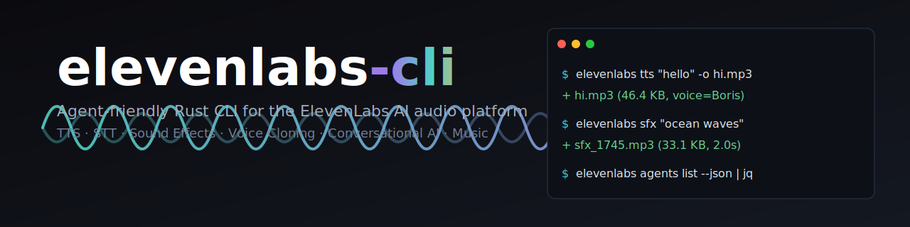

<div align="center">



# `elevenlabs-cli`

**One Rust binary. Every [ElevenLabs](https://elevenlabs.io) endpoint. No MCP server, no Python runtime, no drift.**

TTS • STT • Sound Effects • Voice Cloning • Voice Design • Conversational Agents • Music Generation • Phone Calls — all from your terminal, all machine-readable.

[](https://github.com/paperfoot/elevenlabs-cli/stargazers)
&nbsp;
[](https://x.com/longevityboris)

[](https://crates.io/crates/elevenlabs)
[](https://crates.io/crates/elevenlabs)
[](https://github.com/paperfoot/elevenlabs-cli/actions/workflows/ci.yml)
[](LICENSE)
[](https://www.rust-lang.org/)
[](#contributing)

[Install](#install) • [Quick start](#quick-start) • [Recipes](#recipes) • [Commands](#commands) • [Why](#why-a-cli-instead-of-an-mcp-server) • [For agents](#for-ai-agents) • [Config](#configuration) • [**Contributing**](CONTRIBUTING.md) • [**AGENTS.md** (for LLM contributors)](AGENTS.md)

</div>

---

## What it does

A single ~5 MB Rust binary that exposes the entire ElevenLabs platform on the command line:

```bash
elevenlabs tts "Hello, world"                                        # Text → speech
elevenlabs tts "sync me" --with-timestamps --save-timestamps t.json  # Per-character alignment
elevenlabs stt voicenote.m4a --timestamps character --format srt     # Transcribe + SRT
elevenlabs sfx "rain on a tin roof" --duration 28                    # Sound effects (0.5-30s)
elevenlabs voices clone "My Voice" sample1.wav sample2.wav
elevenlabs voices design "a gruff old lighthouse keeper" --model eleven_ttv_v3 --seed 42
elevenlabs audio isolate noisy.mp3                                   # Extract clean speech
elevenlabs audio convert me.mp3 --voice "Rachel" --stability 0.6     # Voice-to-voice
elevenlabs music compose "lofi chill for a rainy sunday" --length-ms 120000
elevenlabs agents create "triage-bot" --system-prompt "You are a friendly support agent..."
elevenlabs phone call agent_xxx --from-id phnum_yyy --to +14155551234
```

Every command auto-switches between **coloured human output** (terminal) and **JSON envelopes** (piped / `--json`). Exit codes are semantic (`0=ok, 1=transient, 2=config, 3=bad input, 4=rate limited`). Errors carry a machine-readable `code` and an actionable `suggestion` an AI agent can follow literally.

**Grounded against the official [elevenlabs-js v2.43 SDK](https://github.com/elevenlabs/elevenlabs-js)** — every request/response type in this CLI was verified against the Fern-generated schema that ElevenLabs ships for their own SDK.

---

## Install

```bash
# cargo (Linux, macOS, Windows)
cargo install elevenlabs          # crate name is `elevenlabs`, binary name is `elevenlabs`

# Homebrew (macOS, Linux)
brew tap 199-biotechnologies/tap
brew install elevenlabs

# Prebuilt binaries — Linux, macOS (x86_64 + arm64), Windows
curl -L https://github.com/paperfoot/elevenlabs-cli/releases/latest/download/elevenlabs-$(uname -s)-$(uname -m).tar.gz | tar xz
sudo mv elevenlabs /usr/local/bin/
```

Self-update once installed:

```bash
elevenlabs update --check
elevenlabs update
```

---

## Quick start

```bash
# 1. Save your API key (recommended — wins over any ambient env var)
elevenlabs config init --api-key sk_...
elevenlabs config check                     # confirms the key + reports voices available

# 2. Generate speech (+ character-level timings for subtitles / karaoke)
elevenlabs tts "The quick brown fox" -o fox.mp3
elevenlabs tts "Per-character timings" --with-timestamps --save-timestamps t.json -o out.mp3

# 3. Transcribe with character-level accuracy and speaker diarization
elevenlabs stt interview.m4a --timestamps character --diarize --detect-speaker-roles

# 4. Browse voices — /v2/voices so search/sort actually works
elevenlabs voices list
elevenlabs voices library --gender female --accent british --page 1

# 5. Install the skill so Claude / Codex / Gemini discover the CLI automatically
elevenlabs skill install

# 6. Bootstrap an agent with the full capability manifest
elevenlabs agent-info | jq '.commands | keys'
```

---

## Recipes

Real workflows you can paste straight into a shell:

```bash
# ── Lyric-sync subtitle file from any song ────────────────────────────────
# Get per-character start/end times, then let the API produce the SRT.
elevenlabs stt song.mp3 \
  --model scribe_v2 \
  --timestamps character \
  --format srt --format-include-timestamps --format-max-chars-per-line 42 \
  --format-out-dir ./subs

# ── Karaoke-style alignment from generated speech ──────────────────────────
# TTS with per-character alignment JSON (audio + timings.json).
elevenlabs tts "The quick brown fox jumps over the lazy dog" \
  --with-timestamps --save-timestamps fox.timings.json \
  --seed 42 -o fox.mp3
# fox.timings.json → { alignment: { characters, character_start_times_seconds, character_end_times_seconds } }

# ── Deterministic voice clone for A/B testing ─────────────────────────────
elevenlabs tts "Consistent output every run" \
  --seed 42 --apply-text-normalization on --voice "Rachel" -o take.mp3

# ── Call-centre transcript with PII redaction + speaker roles ──────────────
elevenlabs stt call.wav \
  --multi-channel --diarize --detect-speaker-roles \
  --detect-entities pii --redact-entities pii --redaction-mode entity_type \
  --format segmented_json --format-out-dir ./transcripts

# ── YouTube / TikTok transcript without downloading first ──────────────────
elevenlabs stt --source-url "https://youtu.be/…" --timestamps word \
  --keyterm "ElevenLabs" --keyterm "scribe_v2" --save-words words.json

# ── Designed voice with reproducibility ───────────────────────────────────
elevenlabs voices design "a gruff old lighthouse keeper with a warm tone" \
  --model eleven_ttv_v3 --seed 7 --enhance --output-dir ./previews
elevenlabs voices save-preview <generated_id> "Lighthouse Keeper" "gruff, warm"

# ── Long-form music from a composition plan ────────────────────────────────
elevenlabs music plan "cinematic build then drop" --length-ms 90000 > plan.json
elevenlabs music compose --composition-plan plan.json --respect-sections-durations -o track.mp3

# ── Pipe into jq and other tools ──────────────────────────────────────────
elevenlabs voices list --json | jq '.data[] | select(.category=="cloned") | .voice_id'
elevenlabs history list --source TTS --after $(date -v-7d +%s) --json | jq '.data.history | length'
```

---

## Commands

<details>
<summary><b>Speech synthesis &amp; transcription</b></summary>

```bash
# Text-to-speech — routes to convert / stream / with-timestamps based on flags
elevenlabs tts <text> [-o path] [--voice NAME | --voice-id ID] [--model ID]
                     [--format mp3_44100_128] [--stability 0.5] [--similarity 0.75]
                     [--style 0.0] [--speed 1.0] [--speaker-boost true] [--language en]
                     [--stream]                                  # route to /stream endpoint
                     [--with-timestamps [--save-timestamps PATH]] # per-character alignment JSON
                     [--seed 0..4294967295] [--optimize-streaming-latency 0..4]
                     [--previous-text STR] [--next-text STR]     # continuity across splits
                     [--previous-request-id ID (repeatable x3)] [--next-request-id ID]
                     [--apply-text-normalization auto|on|off] [--apply-language-text-normalization]
                     [--no-logging]                              # zero-retention (enterprise)
                     [--use-pvc-as-ivc] [--stdout]

# Speech-to-text — default model scribe_v2; character-level timings for karaoke/lyric sync
elevenlabs stt [FILE] [--from-url URL | --source-url URL]        # local | HTTPS | YouTube/TikTok
              [-o TEXT_PATH] [--save-raw JSON] [--save-words JSON]
              [--model scribe_v2|scribe_v1] [--language ISO]
              [--timestamps none|word|character]                 # 'character' for lyric video sync
              [--diarize] [--num-speakers 1..32] [--diarization-threshold 0..1]
              [--detect-speaker-roles]                           # auto-label agent/customer
              [--audio-events | --no-audio-events] [--no-verbatim]   # no-verbatim = scribe_v2 only
              [--multi-channel] [--pcm-16k]
              [--temperature 0..2] [--seed 0..2147483647]
              [--keyterm WORD (repeatable, up to 1000)]          # vocabulary biasing
              [--detect-entities TYPE] [--redact-entities TYPE]  # PII: all|pii|phi|pci|...
              [--redaction-mode redacted|entity_type|enumerated_entity_type]
              [--format srt|txt|segmented_json|docx|pdf|html (repeatable)]
              [--format-include-speakers] [--format-include-timestamps]
              [--format-segment-on-silence S] [--format-max-segment-duration S]
              [--format-max-segment-chars N] [--format-max-chars-per-line N]
              [--format-out-dir DIR]
              [--no-logging] [--webhook [--webhook-id ID] [--webhook-metadata JSON]]

# Sound effects (0.5-30s per official API)
elevenlabs sfx <prompt> [-o path] [--duration 0.5..30] [--prompt-influence 0.3]
                       [--loop] [--format mp3_44100_128] [--model eleven_text_to_sound_v2]
```

</details>

<details>
<summary><b>Voices (library, search, clone, design)</b></summary>

```bash
elevenlabs voices list [--search TERM] [--sort name|created_at_unix] [--direction asc|desc]
                      [--limit N] [--show-legacy]
elevenlabs voices show <voice_id>
elevenlabs voices search <query>

# Public shared voice library — page is 1-indexed
elevenlabs voices library [--search TERM] [--page 1] [--page-size 20]
                         [--category professional|high_quality|famous]
                         [--gender female] [--age young|middle_aged|old] [--accent british]
                         [--language en] [--locale en-US] [--use-case narration]
                         [--featured] [--min-notice-days N] [--include-custom-rates]
                         [--include-live-moderated] [--reader-app-enabled]
                         [--owner-id ID] [--sort cloned_by_count|usage_character_count_1y]

elevenlabs voices clone <name> <files...> [--description "..."]

# Voice design — per the elevenlabs-js v2.43 SDK schema
elevenlabs voices design <description> [--text "read this"] [--output-dir ./previews]
                        [--model eleven_multilingual_ttv_v2|eleven_ttv_v3]
                        [--loudness -1.0..1.0] [--seed N] [--guidance-scale F]
                        [--enhance] [--stream-previews] [--quality F]

elevenlabs voices save-preview <generated_voice_id> <name> <description>

# Destructive: requires explicit --yes (deletion is irreversible)
elevenlabs voices delete <voice_id> --yes    # alias: rm
```

</details>

<details>
<summary><b>Audio transforms</b></summary>

```bash
elevenlabs audio isolate <file> [-o path] [--pcm-16k]

# Speech-to-speech voice conversion — full voice_settings override
elevenlabs audio convert <file> [--voice NAME | --voice-id ID] [--model ID] [-o path]
                               [--format mp3_44100_128]
                               [--stability 0..1] [--similarity 0..1] [--style 0..1]
                               [--speaker-boost true|false] [--speed 0.7..1.2]
                               [--seed N] [--remove-background-noise]
                               [--optimize-streaming-latency 0..4] [--pcm-16k] [--no-logging]
```

</details>

<details>
<summary><b>Music generation</b></summary>

```bash
# length_ms: 3000-600000 per the official API
elevenlabs music compose [prompt] [--length-ms 3000..600000] [-o path] [--format FMT]
                        [--composition-plan FILE]          # mutually exclusive with prompt
                        [--model music_v1] [--seed N] [--force-instrumental]
                        [--respect-sections-durations] [--store-for-inpainting] [--sign-with-c2pa]

elevenlabs music plan <prompt> [--length-ms 3000..600000] [--model music_v1]
```

</details>

<details>
<summary><b>Conversational AI agents</b></summary>

```bash
elevenlabs agents list                  # alias: ls
elevenlabs agents show <agent_id>        # alias: get
elevenlabs agents create <name>
    --system-prompt "..."
    [--first-message "Hi, how can I help?"]
    [--voice-id ID] [--language en] [--llm gemini-2.0-flash-001]
    [--temperature 0.5] [--model-id eleven_turbo_v2]
elevenlabs agents delete <agent_id>      # alias: rm
elevenlabs agents add-knowledge <agent_id> <name> (--url URL | --file PATH | --text "...")

elevenlabs conversations list [--agent-id ID] [--page-size 30] [--cursor TOKEN]
elevenlabs conversations show <conversation_id>
```

</details>

<details>
<summary><b>Phone calls (outbound via Twilio/SIP)</b></summary>

```bash
elevenlabs phone list
elevenlabs phone call <agent_id> --from-id <phone_number_id> --to +14155551234
```

</details>

<details>
<summary><b>User, history, framework</b></summary>

```bash
elevenlabs user info
elevenlabs user subscription
elevenlabs history list [--page-size 20] [--start-after ID] [--voice-id ID]
                       [--model-id ID] [--before UNIX] [--after UNIX]
                       [--sort-direction asc|desc] [--search TERM] [--source TTS|STS]
elevenlabs history delete <id>

elevenlabs config show | path | set <key> <value> | check | init --api-key sk_...
elevenlabs skill install | status
elevenlabs update [--check]
elevenlabs agent-info          # JSON capability manifest (alias: info)
```

</details>

---

## For AI agents

This CLI is built to be called by autonomous agents. It follows the [Agent CLI Framework](https://github.com/199-biotechnologies/agent-cli-framework) patterns:

- **`agent-info`** returns a complete capability manifest as JSON — no MCP server required, no schema file to fetch.
- **Dual output**: terminal users get colour + tables, piped/`--json` callers get a stable `{version, status, data|error}` envelope.
- **Semantic exit codes**: `0=ok, 1=transient, 2=config/auth, 3=bad input, 4=rate limited`. Agents use these to pick retry, fix-and-retry, or escalate.
- **Errors have suggestions**: every error envelope includes a `suggestion` field with a concrete next command, not vague advice.
- **No interactive prompts** — every flag has an environment or config fallback. Scripts never hang.
- **Installable skill**: `elevenlabs skill install` drops `SKILL.md` into `~/.claude/skills/`, `~/.codex/skills/`, and `~/.gemini/skills/` so agents discover the tool automatically.

Example agent usage:

```bash
# Bootstrap: what can this tool do?
elevenlabs agent-info | jq '.commands | keys'

# Call it, parse structured output, preserve exit code
if output=$(elevenlabs tts "status update" --json -o /tmp/out.mp3); then
  path=$(echo "$output" | jq -r '.data.output_path')
else
  rc=$?
  code=$(echo "$output" | jq -r '.error.code')         # e.g. auth_failed, rate_limited
  suggestion=$(echo "$output" | jq -r '.error.suggestion')
  # 1=transient retry, 2=fix config, 3=fix args, 4=wait then retry
  [ "$rc" -eq 4 ] && sleep 30 && continue
fi
```

**Auth model for agents (v0.1.6+)**: run `elevenlabs config init --api-key sk_...` once per machine. The saved key wins over `ELEVENLABS_API_KEY` so a stale env var in some other tool's `.env` never silently breaks your CLI calls. `elevenlabs config show --json` reports which source is in use and whether an env var is set-but-ignored.

---

## Why a CLI instead of an MCP server?

The [official ElevenLabs MCP server](https://github.com/elevenlabs/elevenlabs-mcp) runs as a stdio subprocess per session, burns context on tool definitions, requires a Python runtime, and drifts from the API. This CLI does the opposite:

|                              | MCP server           | `elevenlabs-cli`              |
|------------------------------|----------------------|-------------------------------|
| Install                      | Python, `uvx`, MCP client | Single ~5 MB static binary    |
| Context cost per tool        | ~550-1400 tokens     | 0 (one shell exec)            |
| Context cost to bootstrap    | ~55k tokens (typical)| One `agent-info` call         |
| Scriptable                   | No                   | Yes (pipes, shell, make, CI)  |
| Works without MCP host       | No                   | Yes                           |
| Offline from first install   | No (needs runtime)   | Yes                           |
| Cold start                   | ~200 ms+             | **<10 ms**                    |
| Memory                       | ~50-80 MB            | **~7 MB**                     |

Benchmarks in the wild: [MCP vs CLI (Scalekit)](https://www.scalekit.com/blog/mcp-vs-cli-use) measured a 32× token overhead for MCP on 75 real tasks. [Speakeasy](https://www.speakeasy.com/blog/how-we-reduced-token-usage-by-100x-dynamic-toolsets-v2) reduced token usage by ~100× by moving agents off MCP onto CLIs. GitHub Copilot [dropped from 40 tools to 13](https://github.blog/ai-and-ml/github-copilot/how-were-making-github-copilot-smarter-with-fewer-tools/) and got better results.

LLMs already know how to drive CLIs — the grammar of `tool subcommand --flag value` is baked into their weights. Give them a tool, not a pamphlet about tools.

---

## Configuration

Config lives in a TOML file at:

| OS      | Path                                                           |
|---------|----------------------------------------------------------------|
| macOS   | `~/Library/Application Support/elevenlabs-cli/config.toml`      |
| Linux   | `~/.config/elevenlabs-cli/config.toml`                         |
| Windows | `%APPDATA%\elevenlabs-cli\config.toml`                         |

Example:

```toml
api_key = "sk_..."

[defaults]
voice_id = "oaGwHLz3csUaSnc2NBD4"
model_id = "eleven_multilingual_v2"
output_format = "mp3_44100_128"
output_dir = "~/Desktop"

[update]
enabled = true
owner = "199-biotechnologies"
repo = "elevenlabs-cli"
```

### API-key precedence (v0.1.6+)

1. **`api_key` in config.toml** — the value you explicitly saved with `config init`
2. `ELEVENLABS_API_KEY` env var — fallback, used when no file key is saved
3. (none) → `auth_missing` error

Why file wins over env: a stale `ELEVENLABS_API_KEY` left exported in `~/.zshrc`, a project `.env` file, or a shell session previously used to be silently "promoted" over a freshly-saved CLI key and produced confusing `Invalid API key` errors. Now the explicit, scope-specific key you saved via `elevenlabs config init` is always what ships on the wire. CI and container setups are unaffected — they don't ship a `config.toml`, so the env var is still picked up as the only source.

Other flags / env vars still apply in the usual order: explicit command-line flags → config → env → defaults.

> **Upgrading from ≤0.1.5**: if you relied on `ELEVENLABS_API_KEY` in your shell overriding a saved config, either delete the `api_key` line from `config.toml`, or overwrite it with `elevenlabs config set api_key <value>`. `elevenlabs config show` now reports which source is being used and calls out the env-var-is-set-but-ignored case.

Secrets are masked in `config show`. The config file is chmod `0600` on Unix.

**Useful env vars**

| Variable | Purpose |
|---|---|
| `ELEVENLABS_API_KEY` | API key used as a fallback when `config.toml` has no `api_key`. |
| `ELEVENLABS_API_BASE_URL` | Override the API base URL (default `https://api.elevenlabs.io`). Use for staging / mock servers. |
| `ELEVENLABS_CLI_CONFIG` | Full path override for `config.toml`. Handy for tests and CI. |

---

## Output contract

**Success** (stdout, piped or `--json`):
```json
{
  "version": "1",
  "status": "success",
  "data": {
    "voice_id": "oaGwHLz3csUaSnc2NBD4",
    "output_path": "/tmp/hello.mp3",
    "bytes_written": 46437
  }
}
```

**Error** (stderr, piped or `--json`):
```json
{
  "version": "1",
  "status": "error",
  "error": {
    "code": "auth_missing",
    "message": "API key not configured",
    "suggestion": "Set your API key: elevenlabs config init --api-key <sk_...>  or: export ELEVENLABS_API_KEY=sk_..."
  }
}
```

---

## Building from source

```bash
git clone https://github.com/paperfoot/elevenlabs-cli
cd elevenlabs-cli
cargo build --release
./target/release/elevenlabs --version
cargo test
```

Requires Rust 1.85+ (2024 edition).

---

## Contributing

PRs welcome. Keep commits focused, follow the existing patterns, and run `cargo fmt && cargo clippy && cargo test` before pushing.

---

## License

MIT © 2026 [199 Biotechnologies](https://github.com/199-biotechnologies). See [LICENSE](LICENSE).

---

<div align="center">

Built by [Boris Djordjevic](https://github.com/longevityboris) at [199 Biotechnologies](https://github.com/199-biotechnologies) using the [Agent CLI Framework](https://github.com/199-biotechnologies/agent-cli-framework).

**If this saves you context or setup time:**

[](https://github.com/paperfoot/elevenlabs-cli/stargazers)
&nbsp;
[](https://x.com/longevityboris)

</div>
